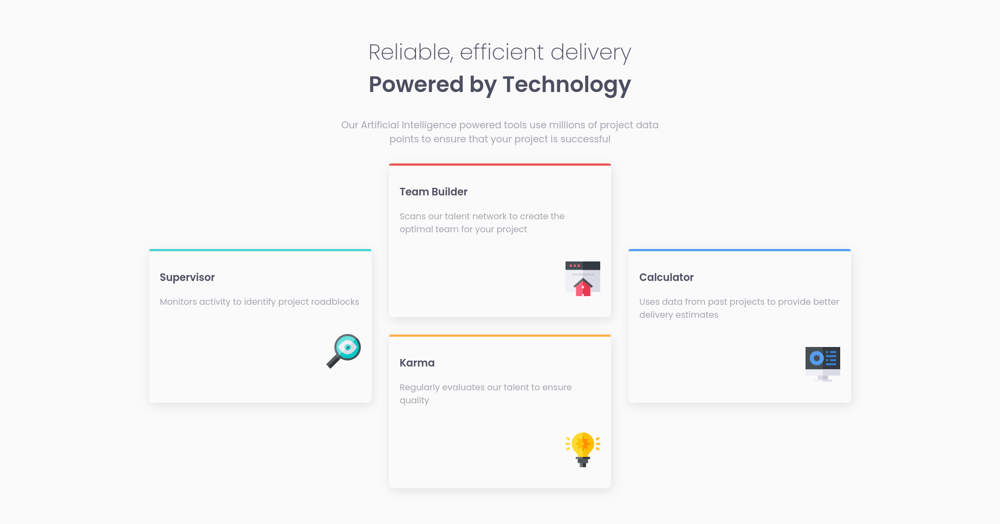

# Frontend Mentor - Four card feature section solution

This is a solution to the [Four card feature section challenge on Frontend Mentor](https://www.frontendmentor.io/challenges/four-card-feature-section-weK1eFYK). Frontend Mentor challenges help you improve your coding skills by building realistic projects. 

## Table of contents

- [Overview](#overview)
  - [Screenshot](#screenshot)
  - [Links](#links)
- [My process](#my-process)
  - [Built with](#built-with)
- [Author](#author)

## Overview

### Screenshot

### Links

- Solution URL: [solution URL](https://github.com/islam4522/FrontEnd-Mentor/tree/master/four-card-feature-section-master)
- Live Site URL: [live site URL](https://islam4522.github.io/FrontEnd-Mentor/four-card-feature-section-master/)

## My process

### Built with

- Semantic HTML5 markup
- CSS custom properties
- Flexbox
- CSS Grid

## Author

- GitHub [@islam4522](https://www.github.com/islam4522)
- Twitter [@islam_madian](https://www.twitter.com/islam_madian)
- LinkedIn [@islam-madian](https://www.linkedin.com/in/islam-madian/)